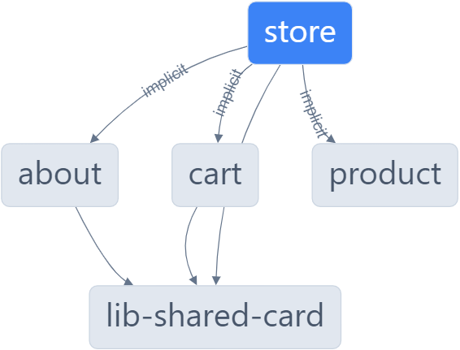

# Nx Demo: Micro front-ends (Angular Host, and Angular and React Remotes) and shared Angular library

## Description

Small project to use Nx to handle a mono-repo. This repo contains 4 projects:
- Angular Host Micro front-end
- Angular Remote Micro front-end
- React Remote  Micro front-end
- Angular Shared Library

## Get Started
Install all the node dependencies
```
npm install
```
To start the application in development mode (live reload)
```
npx nx run store:serve
```

## How to replicate this project
0. This step is optional, but I recommend install `Nx` globally
    ```
    npm i -g nx
    ```
1. Create an empty mono-repo workspace. I'll use `nice` as the mono-repo name
    ```
    npx create-nx-workspace nice --preset=apps
    cd nice
    ```

2. Install React and Angular plugins. Feel free to install all the Nx plugins you want
    ```
    nx add @nx/react
    nx add @nx/angular
    ```
3. Generate the host and remote applications you want. In my case I'll use `shop` as the host, and `cart` (Angular), `about` (Angular), and `product` (React) as the remotes. I recommend create all the micro front-end applications inside the `apps` folder.
    - React
    ```
    nx g @nx/react:host shop --remotes=cart,about --directory=./apps
    ```
    - Angular
    ```
    nx g @nx/angular:host shop --remotes=cart,about --directory=./apps
    ```

    You can leave off the `--remotes` option and add them later with
    ```
    nx g @nx/react:remote cart --host=shop --directory=./apps
    ```
    Or
    ```
    nx g @nx/angular:remote cart --host=shop --directory=./apps
    ```
    Just consider that the `--host` option must be of the same type as the remote application. That is, if the host is an Angular app, you can add remote Angular apps with the `--host` option. Otherwise it should be omitted.
4. Generate a shared [library](https://nx.dev/nx-api/angular/generators/library#nxangularlibrary). I'll use `shared-card` as the library name. I recommend create all shared libraries inside the `libs` folder.
    ```
    nx generate @nx/angular:library --name=shared-card --publishable=true --directory=./lib
    ```
5. At this point all the Angular projects (the host, remote and library) can be used. Just need to serve the host app
    ```
    nx serve shop
    ```

## Considerations
I had some issues integrating the React micro front-end to the Angular host. I follow these [steps](https://stackoverflow.com/questions/76515637/load-react-mfe-into-angular-host-with-nx-and-angular-architects) to fix it. It's necessary to create a `customElement` with the expected React class.

To use the React micro frontend in a specific route I added this configuration in the `apps/store/src/app/app.routes.ts`. Remember pointing to the correct port.

```ts
export const appRoutes: Route[] = [
  ...
  {
    path: 'product',
    component: WebComponentWrapper,
    data: {
      remoteEntry: `http://localhost:4204/remoteEntry.js`,
      remoteName: 'product_mfe',
      exposedModule: './Module',
      elementName: 'product-mfe',
    } as WebComponentWrapperOptions,
  },
  ...
];
```

## Nx Graph

